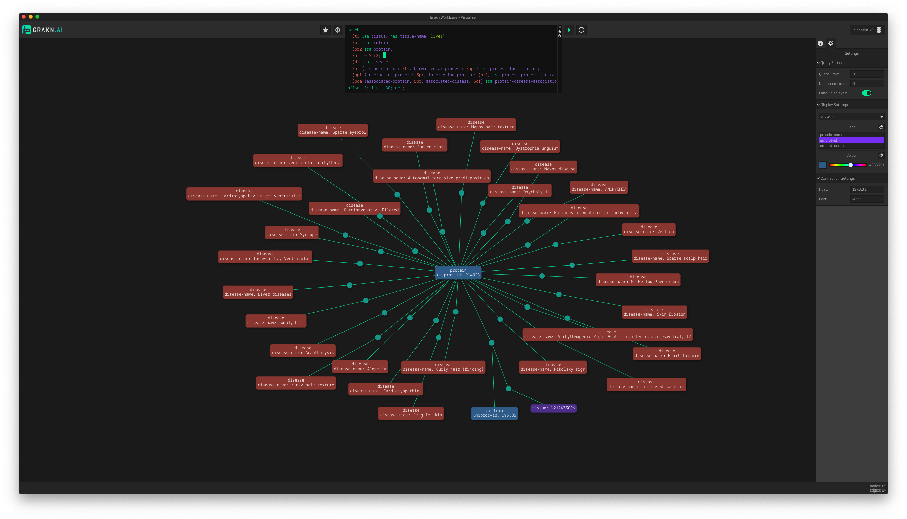

# BioGrakn

BioGrakn is a single knowledge graph of biomedical data ingested from [Uniprot](https://www.uniprot.org/), [Reactome](https://reactome.org/), [DGIdb](http://www.dgidb.org/), [DisGeNET](http://www.disgenet.org/web/DisGeNET/menu;jsessionid=np5qutaldora6gql80xqhmen), [HPA-Tissue](https://www.proteinatlas.org/humanproteome/tissue+specific), [EBI IntAct](https://www.ebi.ac.uk/intact/), [Kaneko](https://www.ncbi.nlm.nih.gov/pmc/articles/PMC3558318/), [Gene Expression Omnibus](https://www.ncbi.nlm.nih.gov/geo/) and [TissueNet](http://netbio.bgu.ac.il/tissuenet/).

BioGrakn provides an intuitive way to query interconnected and heterogeneous biomedical data in one single place. The schema that models the underlying knowledge graph alongside the descriptive query language, Graql, makes writing complex queries an extremely straightforward and intuitive process. Furthermore, the automated reasoning capability of Grakn, allows BioGrakn to become an intelligent database of biomedical data that infers implicit knowledge based on the explicitly stored data. BioGrakn can understand biological facts, infer based on new findings and enforce research constraints, all at query(run) time.

## Quickstart

1. Download the latest release.
2. Unzip the downloaded file.
3. `cd` into the unzipped folder, via terminal or command prompt.
4. run `./grakn start server`

## Interacting With BioGrakn
Queries can be run over BioGrakn, via Graql Console, Grakn Clients and Grakn Workbase.

### Via Graql Console
While inside the unzipped folder, via terminal or command prompt, run: `./graql console -k biograkn_v2`. The console is now ready to answer your queries.

### Via Grakn Clients
Grakn Clients are available for [Java](https://github.com/graknlabs/grakn/tree/master/client-java), [Node.js](https://github.com/graknlabs/grakn/tree/master/client-nodejs) and [Python](https://github.com/graknlabs/grakn/tree/master/client_python). Through these clients, you will be able to perform read and write operations over BioGrakn.
See an example of how this is done in the [Grakn <> BLAST integration example](./examples/blast/analysis.py).

### Via Grakn Workbase
Download the [latest release of Grakn Workbase](https://github.com/graknlabs/grakn/releases), install and run it.

Read the [documentation on Workbase](http://dev.grakn.ai/docs/workbase/visualiser) or watch a short series of videos about [using workbase with the Grakn <> BLAST integration example](https://www.youtube.com/watch?v=PZoG-M_hY30&index=4&list=UUtZKw0RFof3x23KqGtW3yDA).

## Understanding the Schema
The schema for the BioGrakn knowledge graph defines how the knowledge graph is modelled to represent the reality of its dataset. To understand the underlying ontology, you may read through the [`schema.gql`](./schema.gql) or view the [visualised schema](./visualised-schema.png).

## An example Query
Below are a few examples of the queries ran over BioGrakn via workbase.

### What are diseases that are associated with protein interactions taking place in the liver?

```
match
  $ti isa tissue, has tissue-name "liver";
  $pr isa protein;
  $pr2 isa protein;
  $pr != $pr2;
  $di isa disease;
  $pl (tissue-context: $ti, biomolecular-process: $ppi) isa process-localisation;
  $ppi (interacting-protein: $pr, interacting-protein: $pr2) isa protein-protein-interaction;
  $pda (associated-protein: $pr, associated-disease: $di) isa protein-disease-association;
offset 0; limit 30; get;
```




## References
- **[BioGrakn: Accelerating Biomedical Knowledge Discovery with a Grakn Knowledge Graph](https://blog.grakn.ai/biograkn-accelerating-biomedical-knowledge-discovery-with-a-grakn-knowledge-graph-84706768d7d4)**
- **[BioGrakn: A Knowledge Graph-Based Semantic Database for Biomedical Sciences](https://link.springer.com/chapter/10.1007/978-3-319-61566-0_28)**