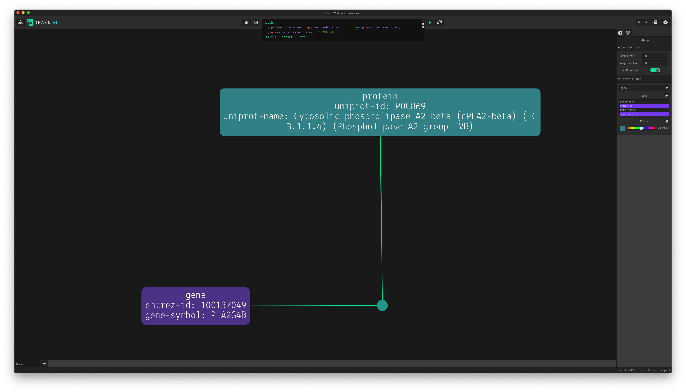

# BioGrakn DN - Disease Networks (DN)

BioGrakn DN is a single knowledge graph of biomedical data describing disease networks, ingested from [Uniprot](https://www.uniprot.org/), [Reactome](https://reactome.org/), [DGIdb](http://www.dgidb.org/), [DisGeNET](http://www.disgenet.org/web/DisGeNET/menu;jsessionid=np5qutaldora6gql80xqhmen), [HPA-Tissue](https://www.proteinatlas.org/humanproteome/tissue+specific), [EBI IntAct](https://www.ebi.ac.uk/intact/), [Kaneko](https://www.ncbi.nlm.nih.gov/pmc/articles/PMC3558318/), [Gene Expression Omnibus](https://www.ncbi.nlm.nih.gov/geo/) and [TissueNet](http://netbio.bgu.ac.il/tissuenet/).

BioGrakn DN provides an intuitive way to query interconnected and heterogeneous biomedical data in one single place. The schema that models the underlying knowledge graph alongside the descriptive query language, Graql, makes writing complex queries an extremely straightforward and intuitive process. Furthermore, the automated reasoning capability of Grakn, allows BioGrakn DN to become an intelligent database of biomedical data that infers implicit knowledge based on the explicitly stored data. BioGrakn DN can understand biological facts, infer based on new findings and enforce research constraints, all at query (run) time.

## Quickstart

1. Download [the latest release](https://www.dropbox.com/s/tn6ney3nc0vwm6f/grakn-core-1.4.2-biograkn_dn-0.1.zip?dl=1) (size: 2.5 GB).
2. Unzip the downloaded file.
3. `cd` into the unzipped folder, via terminal or command prompt.
4. run `./grakn server start`

## Interacting With BioGrakn DN
Queries can be run over BioGrakn DN, via Graql Console, Grakn Clients and Grakn Workbase.

### Via Grakn Console
While inside the unzipped folder, via terminal or command prompt, run: `./grakn console -k biograkn_dn`. The console is now ready to answer your queries.

### Via Grakn Clients
Grakn Clients are available for [Java](https://github.com/graknlabs/grakn/tree/master/client-java), [Node.js](https://github.com/graknlabs/grakn/tree/master/client-nodejs) and [Python](https://github.com/graknlabs/grakn/tree/master/client_python). Using these clients, you will be able to perform read and write operations over BioGrakn DN.
See an example of how this is done in the [Grakn <> BLAST integration example](./examples/blast/analysis.py), using the [Python](https://github.com/graknlabs/grakn/tree/master/client_python) client.

### Via Grakn Workbase
Download the [latest release of Grakn Workbase](https://github.com/graknlabs/grakn/releases), install and run it.

Read the [documentation on Workbase](http://dev.grakn.ai/docs/workbase/visualiser) or watch a short series of videos about [using workbase with the Grakn <> BLAST integration example](https://www.youtube.com/watch?v=pHIer5roF4c&list=PLtEF8_xCPklaTR4RaB3ng9V3Ov7n980cQ).

## Understanding the Schema
The schema for the BioGrakn DN knowledge graph defines how the knowledge graph is modelled to represent the reality of its dataset. To understand the underlying data structure, you may read through the [`schema.gql`](./schema.gql) or view the [visualised schema](./visualised-schema.png).

## Example Queries

### Which protein(s) are encoded by the gene with entrez-id of 100137049?

```
match
  $gpe (encoding-gene: $ge, encoded-protein: $pr) isa gene-protein-encoding;
  $ge isa gene has entrez-id "100137049";
limit 10; get;
```



### Which diseases affect the appendix tissue?
Note that the data to answer this question is not explicitly stored in the knowledge graph. The [`protein-disease-association-and-tissue-enhancement-implies-disease-tissue-association Rule`](./schema.gql#L216) enables us to get the answer to this question using the following query.

```
match
  $ti isa tissue has tissue-name "appendix";
  $dta (associated-disease: $di, associated-tissue: $ti) isa disease-tissue-association;
limit 10; get;
```


### What are the proteins associated with Asthma?
Note that the data to answer this question is not explicitly stored in the knowledge graph. The [`gene-disease-association-and-gene-protein-encoding-protein-disease-association Rule`](./schema.gql#L169) enables us to get the answer to this question using the following query.

```
match
  $di isa disease has disease-name "Asthma";
  $dda (associated-protein: $pr, associated-disease: $di) isa protein-disease-association;
limit 10; get;
```


### Which diseases are associated with protein interactions taking place in the liver?
This query also makes use of the [`gene-disease-association-and-gene-protein-encoding-protein-disease-association Rule`](./schema.gql#L169).

```
match
  $ti isa tissue, has tissue-name "liver";
  $pr isa protein;
  $pr2 isa protein;
  $pr != $pr2;
  $di isa disease;
  $pl (tissue-context: $ti, biomolecular-process: $ppi) isa process-localisation;
  $ppi (interacting-protein: $pr, interacting-protein: $pr2) isa protein-protein-interaction;
  $pda (associated-protein: $pr, associated-disease: $di) isa protein-disease-association;
limit 30; get;
```


### Which drugs and diseases are associated with the same differentially expressed gene from comparisons made in geo-series with id of GSE27876?

```
match
  $geo-se isa geo-series has GEOStudy-id "GSE27876";
  $comp (compared-groups: $geo-comp, containing-study: $geo-se) isa comparison;
  $def (conducted-analysis: $geo-comp, differentially-expressed-gene: $ge) isa differentially-expressed-finding;
  $dgi (target-gene: $ge, interacted-drug: $dr) isa drug-gene-interaction;
  $gda (associated-gene: $ge, associated-disease: $di) isa gene-disease-association;
limit 10; get;
```


## References
- **[BioGrakn DN: Accelerating Biomedical Knowledge Discovery with a Grakn Knowledge Graph](https://blog.grakn.ai/BioGrakn-accelerating-biomedical-knowledge-discovery-with-a-grakn-knowledge-graph-84706768d7d4)**
- **[BioGrakn DN: A Knowledge Graph-Based Semantic Database for Biomedical Sciences](https://link.springer.com/chapter/10.1007/978-3-319-61566-0_28)**